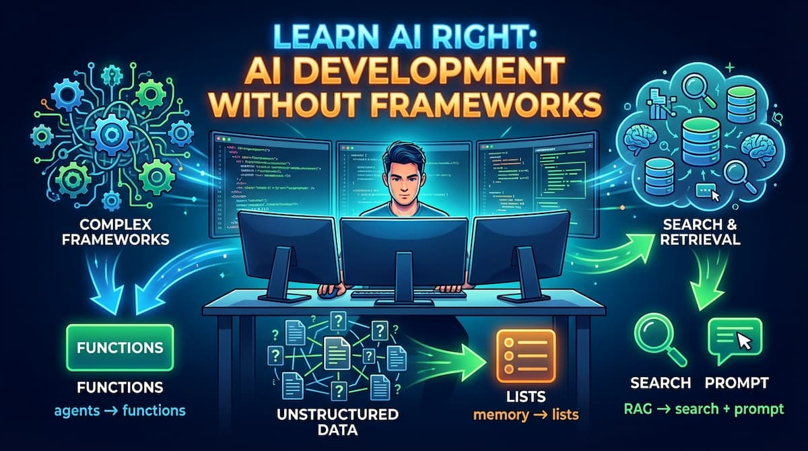

# Learn AI Development Without Frameworks

**Completely updated as of September 28, 2026.**

**Learn AI fundamentals without frameworks. Just Python, APIs, and clarity.**



## Why This Exists

When I started learning AI development, I found endless tutorials on various frameworks and libraries. But when something broke, I had no idea what was actually happening under the hood. I couldn't debug issues, optimize performance, or make informed architectural decisions.

This course fills that gap. It teaches you what AI systems actually do, stripped of abstractions and marketing jargon. You'll learn the foundational patterns that all AI applications use - whether they admit it or not.

## The Philosophy

**Frameworks have their place.** I use them. I like several of them. But jumping into a framework without understanding the fundamentals is inefficient. You build on shaky ground.

This course teaches you what's really happening when you:

- Chat with an AI
- Give it memory
- Make it use tools
- Have it search your documents
- Build multi-step workflows

Once you understand these patterns, you can use any framework effectively—or build exactly what you need without one.

## What AI Actually Is

The industry loves complex terminology. Here's what things really are:

| Industry Term                            | What It Actually Is                                                     |
| ---------------------------------------- | ----------------------------------------------------------------------- |
| **AI Agents**                            | Python functions the AI decides to call                                 |
| **Memory/Context**                       | A Python list of messages you send with each request                    |
| **RAG (Retrieval Augmented Generation)** | Search for relevant text + add to prompt + ask AI                       |
| **Multi-Agent Systems**                  | Sequential API calls with logic between them                            |
| **Embeddings/Vector DBs**                | Useful for large datasets, but keyword search works fine for most cases |
| **Prompt Chaining**                      | Call AI → process result → call AI again                                |

That's it. No magic. Just API calls and basic programming.

## What You'll Learn

This course now follows a clean **10-step canonical path**:

1. **First AI Call** - The basic pattern every AI application uses
2. **Memory as List** - The stateless truth behind chatbots
3. **Memory with `previous_response_id`** - OpenAI convenience chaining
4. **Structured Outputs** - Turning model output into typed, validated data
5. **Tool Calling** - Making AI take actions through functions
6. **RAG** - Making AI answer questions from your documents
7. **Conversational RAG** - Adding follow-up questions to document Q&A
8. **Streaming** - Displaying AI responses word-by-word in real-time
9. **Prompt Chaining** - Building multi-step AI workflows
10. **Capstone (OpenAI-only)** - One end-to-end project combining everything

By the end, you'll understand how production AI systems work under the hood.

## API Versions in This Repo

- OpenAI examples use the **Responses API** (`client.responses.create(...)`). The structured-output lesson uses `client.responses.parse(...)`.
- Anthropic examples use the **Messages API**. The structured-output lesson uses `client.messages.parse(...)`.
- Models are configurable via env vars:
  - `OPENAI_MODEL` (default: `gpt-6-luna` in lessons 1-9; `gpt-6-sol` in the capstone)
  - `ANTHROPIC_MODEL` (default: `claude-sonnet-5-5` in Anthropic examples)

The examples still show each API call, message list, tool request, and retrieval step directly. Newer reasoning models may return non-text items alongside text, so the lessons check completion and keep the response items needed for conversation continuity.

## Prerequisites

**You only need to know Python.** That's it.

No machine learning background. No advanced math. No framework experience.

If you can write functions, loops, and understand lists and dictionaries, you're ready.

## Quick Start

**1. Clone this repository**

```bash
git clone https://github.com/jmedia65/learn-ai-right.git
cd learn-ai-right
```

**2. Install dependencies**

```bash
pip install -r requirements.txt
```

**3. Set up your API keys**

Copy `.env.example` to `.env`:

```bash
cp .env.example .env
```

Add your API keys to `.env`:

```
ANTHROPIC_API_KEY=your_anthropic_key_here
OPENAI_API_KEY=your_openai_key_here
# Optional:
# ANTHROPIC_MODEL=claude-sonnet-5-5
# OPENAI_MODEL=gpt-6-luna
```

Get API keys:

- Anthropic: https://console.anthropic.com/
- OpenAI: https://platform.openai.com/api-keys

**4. Start with the first module**

```bash
cd 01-first-ai-call
python 01_anthropic_basic.py
```

## Course Structure

Each module contains:

- A README explaining the concept
- OpenAI examples (all steps)
- Anthropic companion examples (most steps)
- Heavily commented code showing exactly what's happening
- A `Quick Exercise` and `What Breaks in Production` section for deliberate practice

Work through them in order:

### [01 - First AI Call](./01-first-ai-call)

Learn the foundational pattern: initialize → call → extract response.

### [02 - Memory as List](./02-memory-list)

Understand how chatbots remember context (spoiler: it's just a list).

### [03 - Memory with `previous_response_id` (OpenAI)](./03-memory-previous-response-id)

Learn OpenAI's state-chaining convenience API after mastering list-based memory.

### [04 - Structured Outputs](./04-structured-outputs)

Bridge module: get typed, validated outputs before tool calling.

### [05 - Tool Calling](./05-tool-calling)

Make AI take actions by calling your Python functions.

### [06 - RAG](./06-rag)

Make AI answer questions from your own documents.

### [07 - Conversational RAG](./07-conversational-rag)

Add follow-up questions to your document Q&A system.

### [08 - Streaming](./08-streaming)

Display AI responses in real-time, word by word.

### [09 - Prompt Chaining](./09-prompt-chaining)

Build multi-step AI workflows and "agent" systems.

### [10 - Capstone (OpenAI-only)](./10-capstone-openai)

Build one complete AI Learning Coach that combines memory, structured outputs, tools, RAG, streaming, and chaining.

## About

I'm [Max Braglia](https://maxbraglia.com/), an independent operator working across marketing, web development, and applied AI. I build, market, and monetize digital assets and help businesses do the same. I built this course because I wish it existed when I started learning AI development.

I write [The Operator's Notebook](https://maxbraglia.substack.com) about marketing, engineering, and AI from inside the work: what I'm building, what's working, and what isn't. If you find this course valuable, you can follow along there.

## License

MIT License - use this code however you want. Learn, build, teach others.
